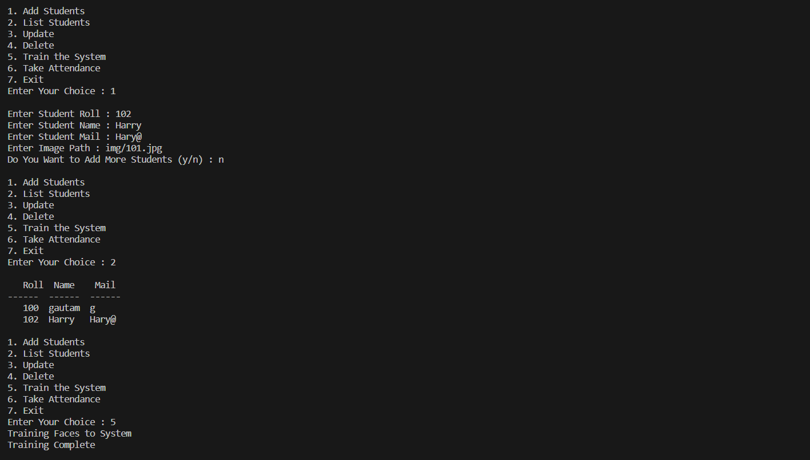
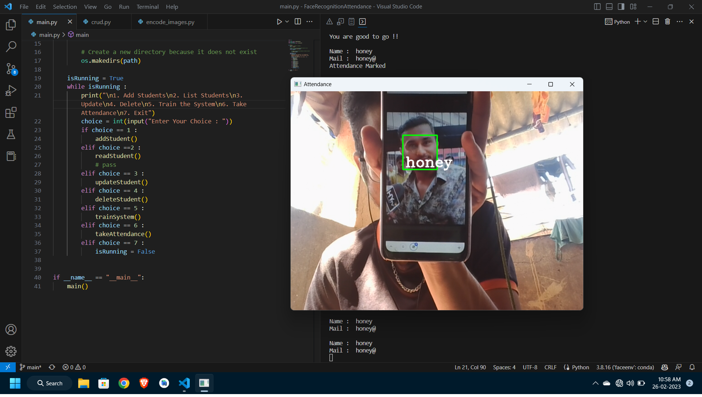
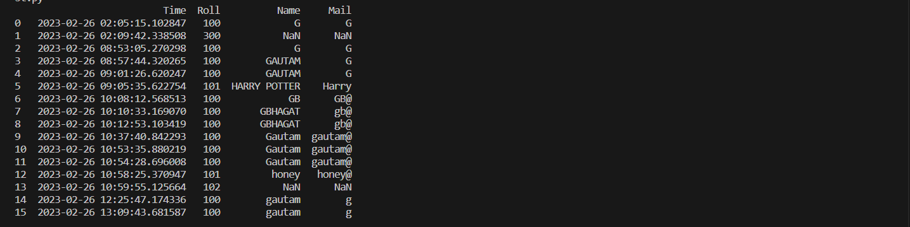

# Face Recognition Based Attendance
<br>
<p>The project is Command Line based Application which allows to <ul><li>Add Student </li><li>Display Students Record</li> <li>Update any student record<li>Delete a Record </ul> 
<b>The main purpose of project is to recognize student from the database with face features and mark thier attendance</b></p>

## Libraries Used
```
Python Version 3.9
```
Mainly,
<ol>
<li> <code>face_recognition</code> : Recognise and Manipulate face from images
<li> <code>opencv</code> : To work with webcam and image files
<li> <code>numpy</code> : To store face features / encodings and work with array
<li> <code>cmake & dlib</code> : Required libraries to work with face_recognition
</ol>

## Working

```
1. Add Students
2. List Students
3. Update
4. Delete
```
All above allows CRUD operations of student

```
5. Train the System
6. Take Attendance
7. Exit
```
<code>Train the System</code> : Finds Encoding of face using the library and is dumped using pickle<br>
<code>Take Attendance</code> : Captures live image and using encodings it recognises the face.

## Output


<b>Detected Face</b>



<b>Attendance CSV</b>

